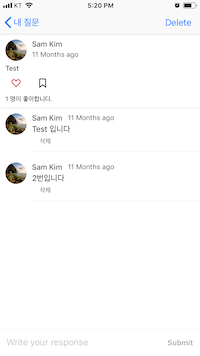

# Fire-1.0.3

This project was for my startup idea that help teachers and students create a QnA board together and thus communicate better with what they learn. I launched this app through the app store in Oct 2017.

## Screenshots 

## Features 
Built the layout programmatically without storyboards
Used auto-layout to support multiple devices
Asynchronously fetched images from the DB 
Used image caching to load images fast and efficiently 

